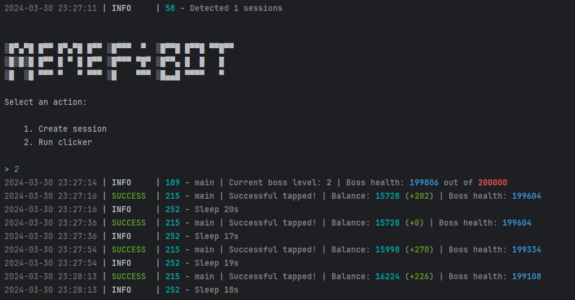

# MemeFiBot

[](https://t.me/jodohsaya)



## Fungsionalitas
| Fungsional                                                     | Didukung  |
|----------------------------------------------------------------|:---------:|
| Multithreading                                                 |     ✅     |
| Menghubungkan proxy ke sesi                                    |     ✅     |
| Pembelian otomatis item jika memiliki koin (tap, energi, charge)|    ✅     |
| Waktu tidur acak antara klik                                   |     ✅     |
| Jumlah klik acak per permintaan                                |     ✅     |
| Mendukung tdata / pyrogram .session / telethon .session        |     ✅     |

## [Pengaturan](https://github.com/shamhi/MemeFiBot/blob/main/.env-example)
| Pengaturan                | Deskripsi                                                                               |
|---------------------------|----------------------------------------------------------------------------------------|
| **API_ID / API_HASH**     | Data platform untuk meluncurkan sesi Telegram (standar - Android)                      |
| **MIN_AVAILABLE_ENERGY**  | Jumlah minimum energi yang tersedia, setelah mencapai ini akan ada penundaan (misalnya 100) |
| **SLEEP_BY_MIN_ENERGY**   | Penundaan saat mencapai energi minimum dalam detik (misalnya 200)                      |
| **ADD_TAPS_ON_TURBO**     | Berapa banyak tap yang akan ditambahkan saat turbo diaktifkan (misalnya 2500)          |
| **AUTO_UPGRADE_TAP**      | Apakah saya harus meningkatkan tap (True / False)                                      |
| **MAX_TAP_LEVEL**         | Level maksimum peningkatan tap (misalnya 5)                                            |
| **AUTO_UPGRADE_ENERGY**   | Apakah saya harus meningkatkan energi (True / False)                                   |
| **MAX_ENERGY_LEVEL**      | Level maksimum peningkatan energi (misalnya 5)                                         |
| **AUTO_UPGRADE_CHARGE**   | Apakah saya harus meningkatkan charge (True / False)                                   |
| **MAX_CHARGE_LEVEL**      | Level maksimum peningkatan charge (misalnya 5)                                         |
| **APPLY_DAILY_ENERGY**    | Apakah menggunakan peningkatan energi harian gratis (True / False)                     |
| **APPLY_DAILY_TURBO**     | Apakah menggunakan turbo harian gratis (True / False)                                  |
| **RANDOM_CLICKS_COUNT**   | Jumlah tap acak (misalnya 50,200)                                                      |
| **SLEEP_BETWEEN_TAP**     | Penundaan acak antara tap dalam detik (misalnya 10,25)                                 |
| **USE_PROXY_FROM_FILE**   | Apakah menggunakan proxy dari file `bot/config/proxies.txt` (True / False)             |

## Instalasi
Anda dapat mengunduh [**Repositori**](https://github.com/Semutireng22/memefi) dengan mengkloningnya ke sistem Anda dan menginstal dependensi yang diperlukan:
```shell
git clone https://github.com/Semutireng22/memefi.git
cd MemeFiBot
```

#Linux

Install Python3.10

```shell
sudo apt update
sudo apt install software-properties-common -y
sudo add-apt-repository ppa:deadsnakes/ppa -y
sudo apt update
sudo apt install python3.10 python3.10-venv python3.10-dev -y
```

```shell
python3 -m venv venv
```
```shell
source venv/bin/activate
```
```shell
pip3 install -r requirements.txt
```
```shell
cp .env-example .env
```
```shell
nano .env
```
//Di sini Anda harus menentukan API_ID dan API_HASH Anda, sisanya diambil secara default

```shell
python3 main.py
```

# PEINGATAN!!!
Ubahlah isi file .env sesuai kebutuhan
